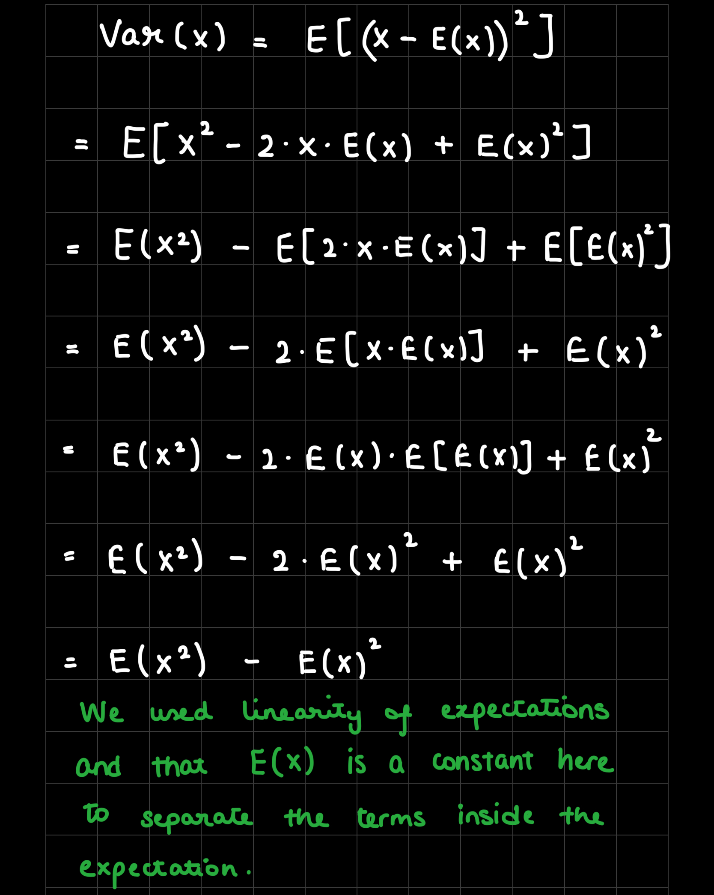

# 

Let $E[X] = \mu$. Show that $Var[X] := E[(X-E[X])^2] = E[X^2]-(E[X])^2$. Note, all you have to do is show the second equality (the first is our definition from class).



# 

In the computational section of this homework, we will discuss support vector machines and tree-based methods. I will begin by simulating some data for you to use with SVM.

```{r}
library(e1071)
set.seed(1) 
x=matrix(rnorm(200*2),ncol=2)
x[1:100,]=x[1:100,]+2
x[101:150,]=x[101:150,]-2
y=c(rep(1,150),rep(2,50))
dat=data.frame(x=x,y=as.factor(y))
plot(x, col=y)

```

## 

Quite clearly, the above data is not linearly separable. Create a training-testing partition with 100 random observations in the training partition. Fit an svm on this training data using the radial kernel, and tuning parameters $\gamma=1$, cost $=1$. Plot the svm on the training data.

```{r}
set.seed(1)

# Dividing the data
training_indices <- sample(1:nrow(dat), 100)
training_data <- dat[training_indices, ]
test_data <- dat[-training_indices, ]

# SVM
svmfit <- svm(y ~ ., data = training_data, kernel = "radial", gamma=1, cost=1, scale=FALSE)

# make grid function from earlier
make.grid <- function(x, n = 75) {
  grange <- apply(x, 2, range)
  x1 <- seq(from = grange[1,1], to = grange[2,1], length = n)
  x2 <- seq(from = grange[1,2], to = grange[2,2], length = n)
  expand.grid(x.1 = x1, x.2 = x2)
}

# 1:2 since that only selects x1 and x2, I dont think we're supposed to include y?
xgrid <- make.grid(training_data[, 1:2])

ygrid <- predict(svmfit, xgrid)

# Plotting the graph
plot(xgrid, col = c("red","blue")[as.numeric(ygrid)], pch = 20, cex = .2)
points(x, col = y + 3, pch = 19)
points(x[svmfit$index,], pch = 5, cex = 2)
```

## 

Notice that the above decision boundary is decidedly non-linear. It seems to perform reasonably well, but there are indeed some misclassifications. Let's see if increasing the cost [^1] helps our classification error rate. Refit the svm with the radial kernel, $\gamma=1$, and a cost of 10000. Plot this svm on the training data.

[^1]: Remember this is a parameter that decides how smooth your decision boundary should be

```{r}
svmfit <- svm(y ~ ., data = training_data, kernel = "radial", gamma=1, cost=10000, scale=FALSE)

# 1:2 since that only selects x1 and x2, I dont think we're supposed to include y?
xgrid <- make.grid(training_data[, 1:2])

ygrid <- predict(svmfit, xgrid)

# Plotting the graph
plot(xgrid, col = c("red","blue")[as.numeric(ygrid)], pch = 20, cex = .2)
points(x, col = y + 3, pch = 19)
points(x[svmfit$index,], pch = 5, cex = 2)

```

## 

It would appear that we are better capturing the training data, but comment on the dangers (if any exist), of such a model.

**-\> In this graph, we do see that we are able to capture the training data a lot better as opposed to the previous graph. However, this can become quite risky when trying to generalize this model. If we introduce new points to the data or try to use this model on a new dataset altogether, it is much more likely to misclassify the data points as it is so rigidly trained with the training data with such a high cost.**

## 

Create a confusion matrix by using this svm to predict on the current testing partition. Comment on the confusion matrix. Is there any disparity in our classification results?

```{r, eval = FALSE}
#remove eval = FALSE in above
table(true=dat[-training_indices,"y"], pred=predict(svmfit, newdata=dat[-training_indices,]))
```

**-\> There is a disparity in our classification results. We see that the model incorrectly classifies many of the Class 1 instances as Class 2 with an accuracy of 78% (17 out of the 79 true Class 1 labels were misclassified as Class 2). Its accuracy for Class 2 is a little better, where it correctly identified 18 out of 21 true Class 2 labels, which gives it an accuracy of 85%.**

Is this disparity because of imbalance in the training/testing partition? Find the proportion of class `2` in your training partition and see if it is broadly representative of the underlying 25% of class 2 in the data as a whole.

```{r}
training_class2_prop <- mean(training_data$y == 2)

full_class2_prop <- mean(dat$y == 2)

print(training_class2_prop)
print(full_class2_prop)
```

**-\> The training data has a 0.29 proportion of Class 2 labels while the full data has a 0.25 proportion for Class 2. This small over representation in the training data is likely due to random variation. This difference does not seem to be the likely cause for the disparity that we see in the classification since the training data does seem to accurately represent the full data. There could be other factors at hand such as the features being used for classification as well as the parameters for SVM (the kernel, gamma value, and cost).**

## 

Let's try and balance the above to solutions via cross-validation. Using the `tune` function, pass in the training data, and a list of the following cost and $\gamma$ values: {0.1, 1, 10, 100, 1000} and {0.5, 1,2,3,4}. Save the output of this function in a variable called `tune.out`.

```{r}

set.seed(1)


```

I will take `tune.out` and use the best model according to error rate to test on our data. I will report a confusion matrix corresponding to the 100 predictions.

```{r, eval = FALSE}
table(true=dat[-train,"y"], pred=predict(tune.out$best.model, newdata=dat[-train,]))
```

## 

Comment on the confusion matrix. How have we improved upon the model in question 2 and what qualifications are still necessary for this improved model.

*Student Response*

# 

Let's turn now to decision trees.

```{r}

library(kmed)
data(heart)
library(tree)

```

## 

The response variable is currently a categorical variable with four levels. Convert heart disease into binary categorical variable. Then, ensure that it is properly stored as a factor.

```{r}


```

## 

Train a classification tree on a 240 observation training subset (using the seed I have set for you). Plot the tree.

```{r}
set.seed(101)

```

## 

Use the trained model to classify the remaining testing points. Create a confusion matrix to evaluate performance. Report the classification error rate.

```{r}


```

## 

Above we have a fully grown (bushy) tree. Now, cross validate it using the `cv.tree` command. Specify cross validation to be done according to the misclassification rate. Choose an ideal number of splits, and plot this tree. Finally, use this pruned tree to test on the testing set. Report a confusion matrix and the misclassification rate.

```{r}
set.seed(101)

```

## 

Discuss the trade-off in accuracy and interpretability in pruning the above tree.

*Student Input*

## 

Discuss the ways a decision tree could manifest algorithmic bias.

*Student Answer*
