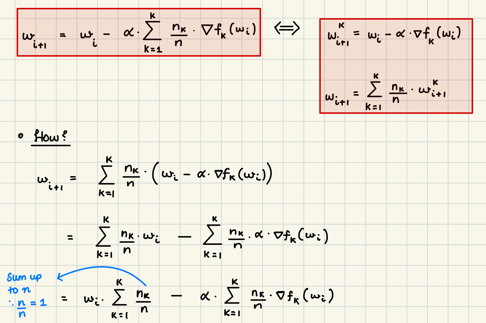
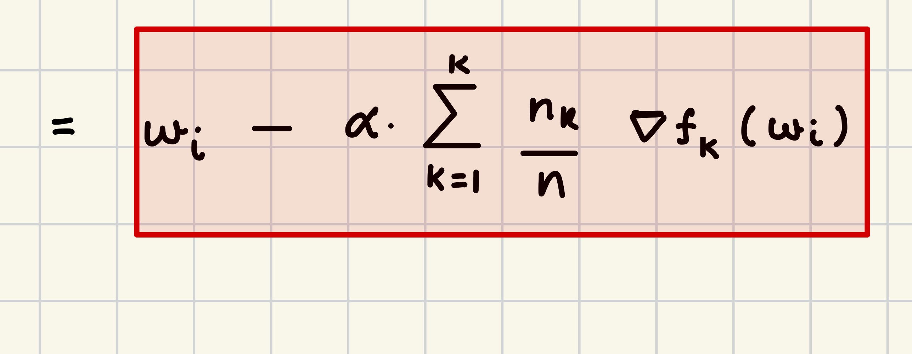
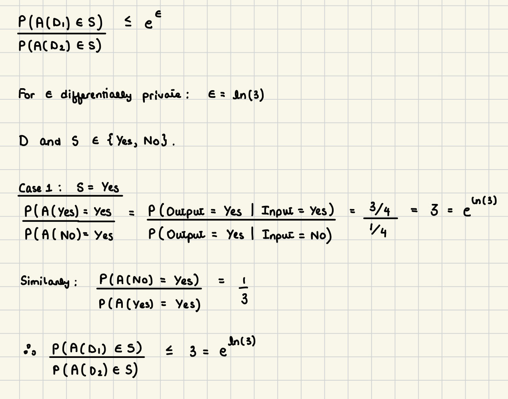

# 

What is the difference between gradient descent and *stochastic* gradient descent as discussed in class? (*You need not give full details of each algorithm. Instead you can describe what each does and provide the update step for each. Make sure that in providing the update step for each algorithm you emphasize what is different and why.*)

**In each iteration of gradient descent, we compute the gradient of the loss function using the entire dataset. This ensures that the update to the loss function is based on the full dataset's loss.**

**This is given as:**

$$\theta_{i+1} = \theta_i - \alpha \nabla f(\theta_i, x, y)$$

**Here, the update is more precise but it has a higher computational cost.**

**In Stochastic Gradient Descent (SGD), we use a random subset of the total data at each step. This means that we can see some level of randomness in each update to the parameters. But this can actually be helpful since this randomness enables us to escape local minima.**

**The update step instead is:**

$$\theta_{i+1} = \theta_i - \alpha \nabla f(\theta_i, X, Y)$$

**where X and Y are subsets of the dataset.**

# 

Consider the `FedAve` algorithm. In its most compact form we said the update step is $\omega_{t+1} = \omega_t - \eta \sum_{k=1}^K{\frac{n_k}{n}\nabla F_k(\omega_t)}$. However, we also emphasized a more intuitive, yet equivalent, formulation given by $\omega_{t+1}^k=\omega_t-\eta\nabla F_k(\omega_t); w_{t+1} = \sum_{k=1}^K{\frac{n_k}{n}w_{t+1}^k}$.

Prove that these two formulations are equivalent.\
(*Hint: show that if you place* $\omega_{t+1}^k$ from the first equation (of the second formulation) into the second equation (of the second formulation), this second formulation will reduce to exactly the first formulation.)

Now give a brief explanation as to why the second formulation is more intuitive. That is, you should be able to explain broadly what this update is doing.

**The second formula is more intuitive as here we can clearly understand the steps that are being taken in order to update the global** $$\omega$$ **value. In this case, each local client takes a step with size** $$\alpha$$ **using the local data. Once each local client has done this, the global weighted average is taken of the resulting local models. Essentially, the updates to each of the "k" local clients are averaged to give a global update.**

# 

Prove that randomized-response differential privacy is $\epsilon$-differentially private.

# 

Define the harm principle. Then, discuss whether the harm principle is *currently* applicable to machine learning models. (*Hint: recall our discussions in the moral philosophy primer as to what grounds agency. You should in effect be arguing whether ML models have achieved agency enough to limit the autonomy of the users of said algorithms.* )

**The harm principle states that the personal autonomy one exercises is limited when this autonomy causes objective harm to another moral agent. Agency and autonomy are very different. Autonomy is the capacity of an agent to act independently - of their own free will. Machine Learning models do not have autonomy as they cannot make decisions of their own free will. They do not possess an understanding of the world as a human does since their behavior is determined purely by data they were trained on. They cannot make decisions of their own volition, they can only carry out some specific operations when they are prompted or specifically instructed to do so. In terms of the harm principle, therefore, the responsibility of such models/algorithms lies in the hands of developers as well as the people who put these models to use. There can be regulations on ML models or certain algorithms that could potentially violate privacy or exercise some sort of bias which in turn can objectively harm people. Therefore, even though the model itself will not execute with an intention to harm, quite literally because it cannot execute by itself, it is crucial to emphasize certain regulations in place in order to inhibit harm that can be caused by the USE of such models.**
