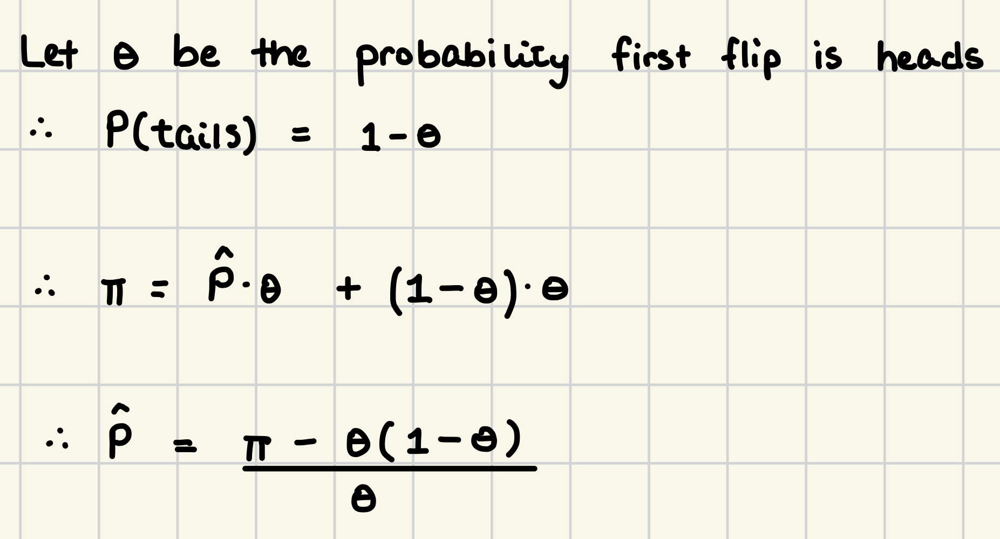
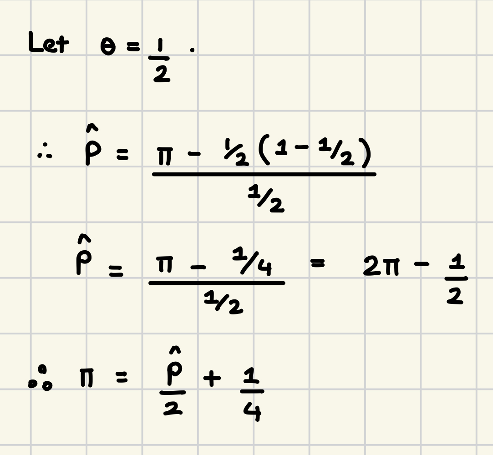

# 

Recall that in class we showed that for randomized response differential privacy based on a fair coin (that is a coin that lands heads up with probability $0.5$), the estimated proportion of incriminating observations $\hat{P}$ [^1] was given by $\hat{P} = 2\hat{\pi}-\frac{1}{2}$ where $\hat{\pi}$ is the proportion of people answering affirmative to the incriminating question.

[^1]: in class this was the estimated proportion of students having actually cheated

I want you to generalize this result for a potentially biased coin. That is, for a differentially private mechanism that uses a coin landing heads up with probability $0 \leq \theta \leq 1$, find an estimate $\hat{P}$ for the proportion of incriminating observations. This expression should be in terms of $\theta$ and $\hat{\pi}$.



# 

Next, show that this expression reduces to our result from class in the special case where $\theta = \frac{1}{2}$.



# 

Part of having an explainable model is being able to implement the algorithm from scratch. Let's try and do this with `KNN`. Write a function entitled `chebychev` that takes in two vectors and outputs the Chebychev or $L^\infty$ distance between said vectors. I will test your function on two vectors below. Then, write a `nearest_neighbors` function that finds the user specified $k$ nearest neighbors according to a user specified distance function (in this case $L^\infty$) to a user specified data point observation.

```{r, eval = FALSE}
#student input
#chebychev function
cheby <- function(x, y) {
  return(max(abs(x - y)))
}
#nearest_neighbors function
nearest_neighbors = function(x, obs, k, dist_func){
  dist = apply(x, 1, dist_func, obs) #apply along the rows
  distances = sort(dist)[1:k]
  neighbor_list = which(dist %in% sort(dist)[1:k])
  return(list (neighbor_list, distances))
}

x<- c(3,4,5)
y<-c(7,10,1)
cheby(x,y)

```

# 

Finally create a `knn_classifier` function that takes the nearest neighbors specified from the above functions and assigns a class label based on the mode class label within these nearest neighbors. I will then test your functions by finding the five nearest neighbors to the very last observation in the `iris` dataset according to the `chebychev` distance and classifying this function accordingly.

```{r, eval = FALSE}
library(class)
df <- data(iris) 
#student input
knn_classifier <- function(neighbors, class_column) {
  # Extract the class labels of the nearest neighbors
  class_labels <- neighbors[, class_column]
  
  # Find the most frequent class (mode)
  mode_class <- names(sort(table(class_labels), decreasing = TRUE))[1]
  
  # Return the predicted class
  return(mode_class)
}

#data less last observation
x = iris[1:(nrow(iris)-1),]
#observation to be classified
obs = iris[nrow(iris),]

#find nearest neighbors
ind = nearest_neighbors(x[,1:4], obs[,1:4],5, chebychev)[[1]]
as.matrix(x[ind,1:4])
obs[,1:4]
knn_classifier(x[ind,], 'Species')
obs[,'Species']

```

# 

Interpret this output. Did you get the correct classification? Also, if you specified $K=5$, why do you have $7$ observations included in the output dataframe?

Yes we have the right classification, which is Virginica. However, we are getting 7 observations since there were likely ties in the Chebyshev Distances. This means multiple points have the same distance from the specified data point observation.

# 

Earlier in this unit we learned about Google's DeepMind assisting in the management of acute kidney injury. Assistance in the health care sector is always welcome, particularly if it benefits the well-being of the patient. Even so, algorithmic assistance necessitates the acquisition and retention of sensitive health care data. With this in mind, who should be privy to this sensitive information? In particular, is data transfer allowed if the company managing the software is subsumed? Should the data be made available to insurance companies who could use this to better calibrate their actuarial risk but also deny care? Stake a position and defend it using principles discussed from the class.

Sensitive healthcare data (such as patient data) should be strictly limited only to those directly involved with patient healthcare and those involved with the development of the algorithm. It should only be used for the benefit of the patient. Releasing patient data to third parties such as insurance companies creates high risk for patients as they can be denied care. Data transfer in the case of an acquisition should occur under strict regulations and only if this data will be continued to be used for its original intended purpose. Releasing this information would prevent the patient control over how their data is used, undermining patient autonomy. Additionally, this follows the principle of utilitarianism as it maximizes the welfare of the patients while also inhibiting potential misuse of the data by restricting access.

# 

I have described our responsibility to proper interpretation as an *obligation* or *duty*. How might a Kantian Deontologist defend such a claim?

According to Kantian Deontology, an act is justifiable only insofar as it can be universalized or generalized to all of humanity. Proper interpretation must be universalizable as one must properly interpret information to ensure accurate understanding and further communication. If everybody were to misinterpret information, society would be non-functional as there would be misinformation and miscommunication everywhere. Therefore, the responsibility to proper interpretation is an obligation that essentially creates the foundation for decision-making in society. Moreover, misinterpretation could lead to harm, exploitation, or wrong decisions, violating the principle of treating individuals as ends.
